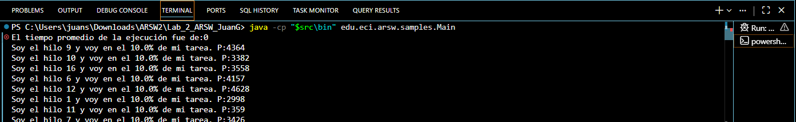
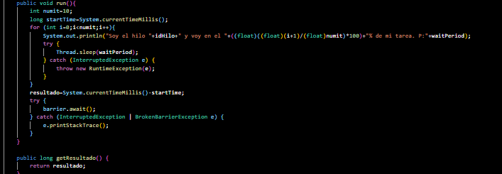
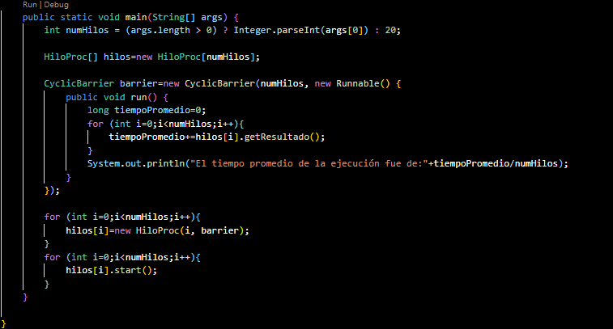
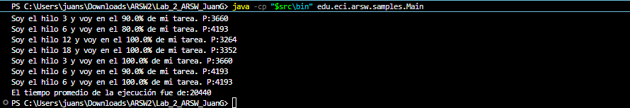

# Lab 2 - ARSW: Barrier Synchronization Pattern

Topic: Thread Synchronization — Barrier Pattern  
Author: Juan  David Gómez Cuellar

---

## Description

This lab explores the Barrier Synchronization pattern in Java. The program launches N threads, each performing the same task at a different speed. The goal is to calculate the average execution time of all threads only after every thread has finished.

---

## Project Structure

```
BarrierSyncProblem/
├── src/
│   └── edu/eci/arsw/samples/
│       ├── Main.java       ← Entry point, creates the barrier and manages threads
│       └── HiloProc.java   ← Thread definition, simulates work and calls barrier.await()
└── bin/                    ← Compiled .class files go here
```

---

## How to Compile and Run

This is a legacy Eclipse project with no Maven or Gradle, so compilation is done manually. Navigate to the `BarrierSyncProblem` folder first, then run:

### Compile

```
cd BarrierSynch\BarrierSynch\BarrierSyncProblem
javac -d "bin" "src\edu\eci\arsw\samples\HiloProc.java" "src\edu\eci\arsw\samples\Main.java"
```

### Run

```
# With N threads
java -cp "bin" edu.eci.arsw.samples.Main <N>

# Default (20 threads)
java -cp "bin" edu.eci.arsw.samples.Main
```

---

## Lab Questions

### 1a. What result does the original program produce? Is it correct? Why?

The result is wrong. The average prints as `0` before the threads even start their work because `Main.java` calls `getResultado()` immediately after `start()`, without waiting for the threads to finish. Since `resultado` has not been written yet, every value is `0`.



---

### 3. Barrier Synchronization Strategy Applied

The solution uses `CyclicBarrier` from `java.util.concurrent`. Each thread calls `barrier.await()` after finishing its work. All threads block at that point until the last one arrives — at that moment the barrier executes its action, which calculates and prints the average.

`HiloProc.java` — the thread receives the barrier and calls `await()` at the end of `run()`:



`Main.java` — the barrier is created with N threads and a barrier action:



---

### 4. Verification

After the fix, every thread reaches 100% before the average is printed:



The average appears at the very end with a real value, confirming the barrier works correctly.

---

## Conclusions

- Without synchronization, the main thread reads results before the worker threads write them, producing incorrect output.
- CyclicBarrier allows threads to wait for each other at a defined point, and executes a barrier action only when all of them have arrived.
- This pattern is reusable and supports a barrier action, making it more flexible than a simple join() for multi-phase or multi-thread coordination.
